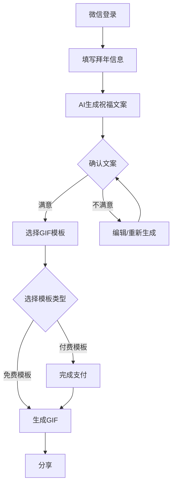

# 走心拜年 - 微信小程序需求文档

## 项目简介
"走心拜年"是一款帮助用户生成个性化拜年祝福的微信小程序。用户通过输入基本信息，可以获得AI生成的走心祝福文案，并将文案与照片合成为精美的拜年GIF图片。

## 项目目标
解决传统网络拜年千篇一律、缺乏诚意的问题，通过AI技术和个性化定制，帮助用户传递真挚的新年祝福。

## 核心功能

### 1. 用户系统
- 微信一键登录
- 用户权限管理（区分免费/付费用户）

### 2. 信息采集
必填信息：
- 收礼人姓名
- 与收礼人关系

选填信息：
- 合影照片上传
- 共同经历/感动事件描述

### 3. AI文案生成
- 基于用户输入生成约100字的个性化祝福文案
- 支持文案编辑
- 支持重新生成

### 4. GIF制作
- 提供多套精美模板
  - 免费模板（清新文艺风格）
  - 付费模板
- 支持照片与文案合成

### 5. 分享功能
- 支持分享到微信好友
- 支持分享到朋友圈

## 用户使用流程

## 技术要点
1. 微信小程序登录接口对接
2. AI文案生成服务
3. 图片处理服务
4. 微信支付功能
5. 分享功能

## 项目范围

### 第一期功能（必须实现）
- 微信登录
- 基础信息采集
- AI文案生成
- 基础免费模板
- GIF生成
- 分享功能

### 后续功能（待定）
- 付费模板系统
- 历史记录功能
- 视频模板功能
- 更多AI模型接入

## 项目规划
1. 第一阶段：基础功能开发（预计2周）
   - 用户系统搭建
   - 信息采集页面
   - AI文案生成接口
   
2. 第二阶段：核心功能开发（预计2周）
   - GIF生成系统
   - 模板管理
   - 分享功能

3. 第三阶段：测试优化（预计1周）
   - 功能测试
   - 性能优化
   - 上线准备 